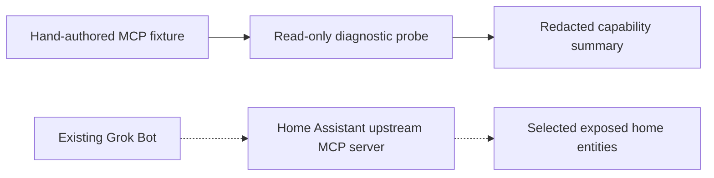

# Grok Gadgets: Home Assistant

This guide uses ASD-STE100-inspired writing. It does not claim formal compliance. See the [project writing guide](https://github.com/adidshaft/grok-gadgets/blob/main/docs/contributing/writing-guide.md).

Use the diagnostic probe to inspect MCP discovery. Use the setup guide to prepare an existing Home Assistant installation for Grok.
This project uses Home Assistant's own MCP server.

**Experimental alpha.** Tests cover discovery fixtures and local client transports.
We have not verified an actual Home Assistant installation, native Grok calls, mobile clients, or physical home devices.
The probe lists capabilities. It does not call tools, read resources, or control your home.



The solid lines show the software-only first step. The dotted lines show the proposed connection to a real home.
That connection needs an authorized installation, compatible authentication, and a reachable endpoint.
Home Assistant can connect directly to the Bot. It does not need the Grok Gadgets gateway or another home-control server.

## Run the fixture first

Clone [adidshaft/grok-gadgets-home-assistant](https://github.com/adidshaft/grok-gadgets-home-assistant) and enter its root directory.

You need Python **3.11**, `uv`, and internet access for the first dependency installation.
You do not need another repository, Home Assistant, a Grok account, a token, or a device.
Tests used macOS arm64. Windows, Intel Mac, and real-home installation remain unverified.

```sh
uv sync --frozen --python 3.11
uv run ha-probe --fixture fixtures/assist.json
uv run python -m unittest discover -s tests -v
```

Expected fixture summary:

```json
{
  "evidence": "fixture tested",
  "tool_count": 2,
  "resource_count": 1,
  "prompt_count": 1,
  "tool_calls_performed": 0,
  "resource_reads_performed": 0,
  "grok_verified": false,
  "hardware_verified": false
}
```

The command also reports the fixture's MCP protocol version and context-capability flags.
The fixture contains manually written discovery data. It does not contain results from a Home Assistant release.
The recorded test run passed **13 tests**. Tests cover discovery validation, pagination limits, authentication failures, URL checks, and private-data removal.
They use mocks and temporary loopback fixture transports.

| Next step | Guide |
| --- | --- |
| Prepare a separately authorized real endpoint | [Setup recipe](docs/setup.md) |
| Understand upstream reuse and remaining Grok requirements | [Feasibility record](docs/feasibility.md) |
| Review the tested environments and limits | [Verification](docs/verification.md) |
| Improve fixtures, diagnostics or documentation | [Contributing](CONTRIBUTING.md) |
| Diagnose installation or discovery errors | [Support](SUPPORT.md) |

## Where this project fits

The [gateway](https://github.com/adidshaft/grok-gadgets-gateway) serves the separate gadget simulator, USB devices and SDK applications. The [Linux SDK](https://github.com/adidshaft/grok-gadgets-linux-sdk) and [ESP32 SDK](https://github.com/adidshaft/grok-gadgets-esp32-sdk) help build new gadgets. This repository reuses Home Assistant's own MCP integration and entity exposure. This repository provides discovery diagnostics and a setup guide. It does not provide an adapter or guarantee general compatibility.

A cloud Grok Bot cannot launch a path on your computer. Check authentication, transport, network access, and call results on the actual client.
The local probe does not prove OAuth compatibility, equal desktop/mobile behavior, automatic event delivery, or physical effects.
The [historical feasibility review](docs/feasibility.md) records sources, dates, and pending experiments. It does not verify the current platform.

Use the [issue chooser](https://github.com/adidshaft/grok-gadgets-home-assistant/issues/new/choose). Keep tokens and household names private; vulnerabilities use [Security](SECURITY.md). General discussion is at [r/GrokGadgets](https://www.reddit.com/r/GrokGadgets/) under the hub's [Code of Conduct](https://github.com/adidshaft/grok-gadgets/blob/main/CODE_OF_CONDUCT.md).

Original code is [Apache-2.0](LICENSE), with attribution in [NOTICE](NOTICE). The package uses the official MCP SDK pinned by [uv.lock](uv.lock); package and dependency license metadata are described in [verification](docs/verification.md). This independent project is unaffiliated with xAI and Home Assistant. Package releases remain pending; use the source installation above.

## History note

Pre-publication commit dates were reconstructed across 29 September–5 October 2026 at the owner’s request. Verification records retain their actual execution dates. See the [history and privacy record](https://github.com/adidshaft/grok-gadgets/blob/main/docs/verification/publication-sanitization.md).
