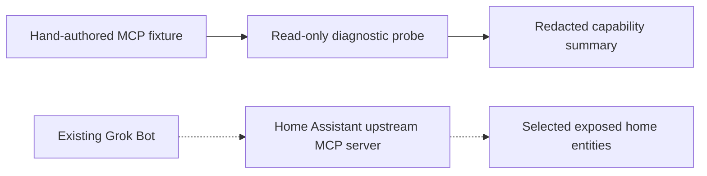

# Grok Gadgets: Home Assistant

Inspect MCP discovery and prepare an existing Home Assistant installation for Grok using Home Assistant's upstream MCP server.

**Experimental alpha — discovery fixtures and local client transports are tested. Actual Home Assistant, native Grok invocation, mobile clients and physical home devices remain unverified.** The included probe lists capabilities; it performs no tool calls, resource reads or home control.



The solid path is the software-only first step. The dotted path is the intended real-home route, requiring an authorized installation, compatible authentication and reachable endpoint. Home Assistant can connect directly to the Bot; it does not need a second Grok Gadgets gateway or duplicate home-control server.

## Run the fixture first

Get this repository's source and enter its root directory. The publication destination is [adidshaft/grok-gadgets-home-assistant](https://github.com/adidshaft/grok-gadgets-home-assistant); until activation, use a reviewed source archive supplied with the local candidate.

Requirements: Python **3.11** and `uv`, with internet access for the initial locked dependency installation. No sibling checkout, Home Assistant instance, Grok account, token or device is needed. The recorded host is macOS arm64; Windows/Intel Mac and real-home installation are not verified.

```sh
uv sync --frozen --python 3.11
uv run ha-probe --fixture fixtures/assist.json
uv run python -m unittest discover -s tests -v
```

Expected fixture summary:

```json
{
  "evidence": "fixture tested",
  "tool_count": 2,
  "resource_count": 1,
  "prompt_count": 1,
  "tool_calls_performed": 0,
  "resource_reads_performed": 0,
  "grok_verified": false,
  "hardware_verified": false
}
```

The command also reports the fixture's MCP protocol version and context-capability flags. These counts describe hand-authored discovery data, not a captured Home Assistant release. The test suite reports **13 tests passed**, covering discovery validation, bounded pagination, authentication failures, URL safeguards and redacted diagnostics through mocked and ephemeral loopback fixture transports.

| Next step | Guide |
| --- | --- |
| Prepare a separately authorized real endpoint | [Setup recipe](docs/setup.md) |
| Understand upstream reuse and remaining Grok requirements | [Feasibility record](docs/feasibility.md) |
| Review the tested environments and limits | [Verification](docs/verification.md) |
| Improve fixtures, diagnostics or documentation | [Contributing](CONTRIBUTING.md) |
| Diagnose installation or discovery errors | [Support](SUPPORT.md) |

## Where this project fits

The [gateway](https://github.com/adidshaft/grok-gadgets-gateway) serves the separate gadget simulator, USB devices and SDK applications. The [Linux SDK](https://github.com/adidshaft/grok-gadgets-linux-sdk) and [ESP32 SDK](https://github.com/adidshaft/grok-gadgets-esp32-sdk) help build new gadgets. This repository reuses Home Assistant's own MCP integration and entity exposure. It currently adds discovery diagnostics and a recipe, not an adapter or a general compatibility guarantee.

A cloud Grok Bot cannot launch a path on your computer. Its authentication, transport, network reachability and inspectable invocation results must be checked on the actual supported client. The local probe does not establish OAuth compatibility, desktop/mobile parity, unsolicited event delivery, or a physical device effect. The [historical feasibility review](docs/feasibility.md) records the source/date and open experiments; it is not a freshly verified platform claim.

Use the [issue chooser](https://github.com/adidshaft/grok-gadgets-home-assistant/issues/new/choose) after repository activation, or the [local ledger](planning/issues.json) during preparation. Keep tokens and household names private; vulnerabilities use [Security](SECURITY.md). General discussion is at [r/GrokGadgets](https://www.reddit.com/r/GrokGadgets/) under the hub's [Code of Conduct](https://github.com/adidshaft/grok-gadgets/blob/main/CODE_OF_CONDUCT.md).

Original code is [Apache-2.0](LICENSE), with attribution in [NOTICE](NOTICE). The package uses the official MCP SDK pinned by [uv.lock](uv.lock); package and dependency license metadata are described in [verification](docs/verification.md). This independent project is unaffiliated with xAI and Home Assistant. Public repositories, releases and reporting settings remain planned destinations until activated.

## History note

Pre-publication commit dates were reconstructed across 29 September–5 October 2026 at the owner’s request. Verification records retain their actual execution dates. See the [history and privacy record](https://github.com/adidshaft/grok-gadgets/blob/main/docs/verification/publication-sanitization.md).
